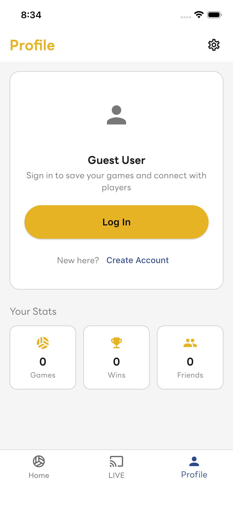
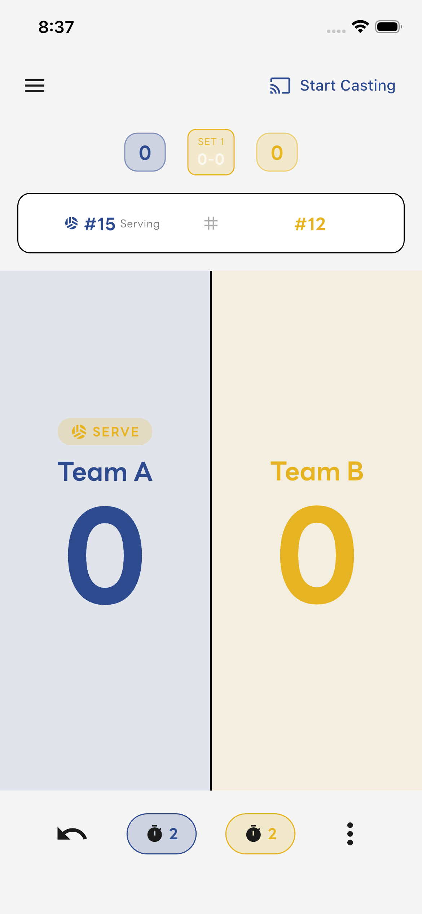
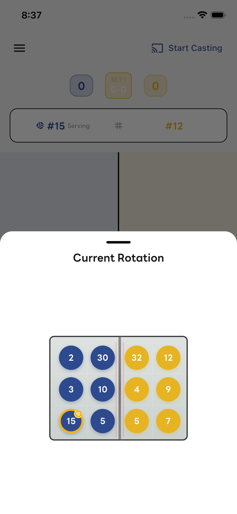
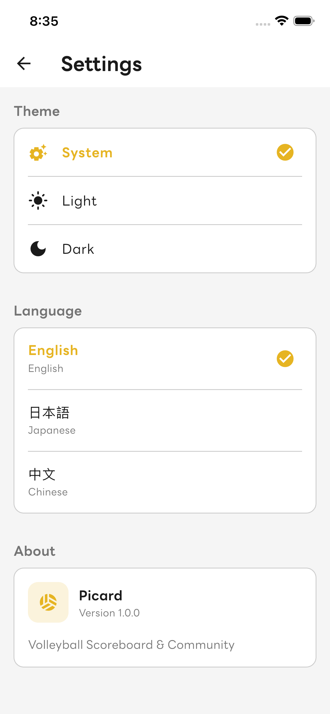
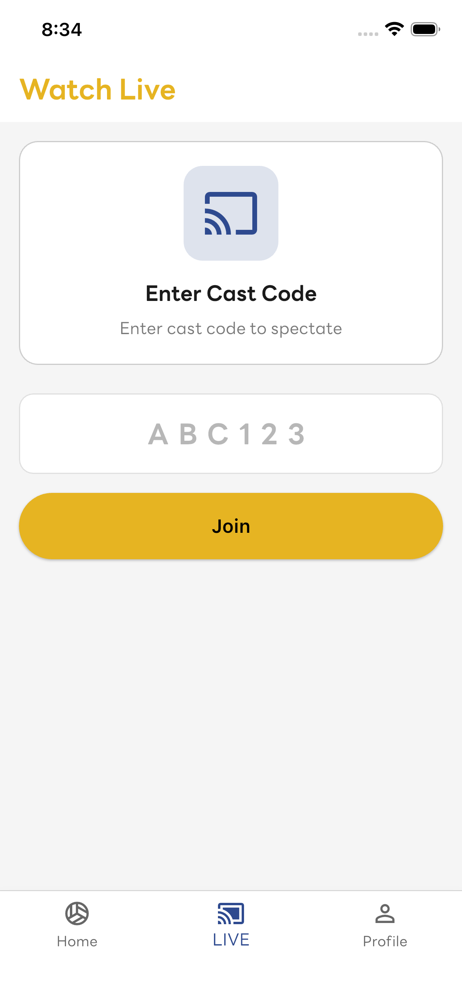

# Picard — Volleyball Scoreboard & Community App

**排球計分板與社群應用程式**

  
  
  

  

  <em>A modern volleyball scoreboard app following official FIVB rules with real-time rotation tracking, libero management, and live game casting.</em>

  <strong>記錄比賽 • 即時分享 • 報名臨打 • 找球友</strong>

  <a href="#features">Features</a> •
  <a href="#screenshots">Screenshots</a> •
  <a href="#tech-stack">Tech Stack</a>

---

## Features

### Official FIVB Rules Support
- **5-Set Match Format** — Best of 5 sets, 25 points (15 in deciding set)
- **2-Point Advantage** — Automatic deuce tracking
- **6 Substitutions Per Set** — With substitution limit enforcement
- **Libero Rules** — Back-row only, serving restrictions tracked

### Rotation Tracking
- **Visual Court Diagram** — See all 6 positions for both teams
- **Automatic Rotation** — Rotates on side-out
- **Serving Indicator** — Always know who's serving
- **Position Validation** — Ensures correct player placement

### Live Casting
- **Share Game Code** — Spectators join with a simple code
- **Real-Time Sync** — Score updates instantly
- **No Account Required** — Viewers can watch without signing up

### Multi-Language
- English
- 日本語  
- 繁體中文

---

## Screenshots

  
  
  

  
  
  

---

## Tech Stack

| | |
|-|-|
| **Framework** | Flutter / Dart |
| **State** | Riverpod |
| **Backend** | Firebase |
| **Storage** | Hive |
| **Architecture** | Clean Architecture |

---

  Made with care for the volleyball community

